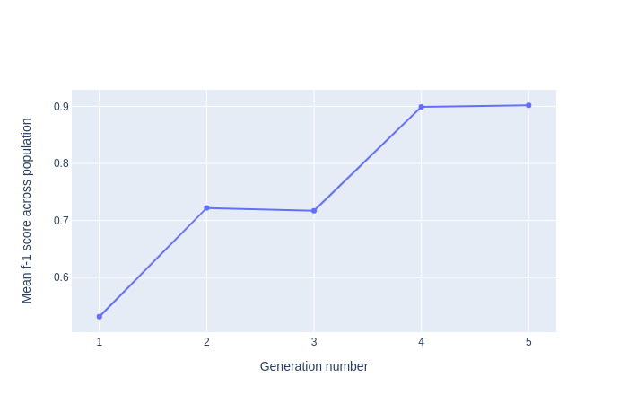

# GE optimizer (simple genetic algorithm-based model optimizer)

Simple notebook to test genetic algorithm for the needs of hyperparameters tuning.

Before running the notebook, make sure that your environment fulfills the requirements.

Or simply type:

    python -m pip install -r requirements.txt

To limit evolution, set the maximum number of generations or a training stop threshold. 
If the process works slow or does not converge, you can increase the probability of mutation or crossover.
If the f-beta function is not growing continuously, reduce the mentioned parameters. 

Bellow example evolution curve.

